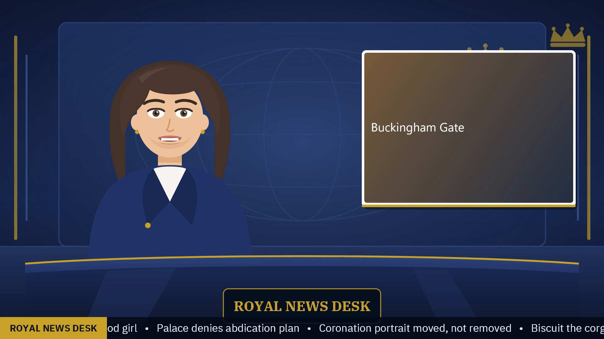
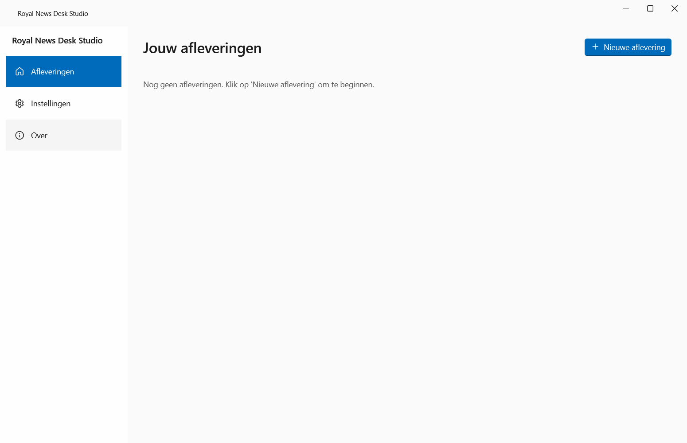

# Royal News Desk Studio

Turn a written news script into a finished YouTube video with one click. An AI voice reads the script, an animated news anchor presents it with lip-sync, and the app adds studio graphics, headlines, a ticker, subtitles, an intro and an outro. Built for the Royal News Desk channel: fact-checking royal news, "separating royal fact from fiction".

Free. Offline after a one-time voice download. No accounts, no API keys.



## Download

**[Download the latest Setup.exe](https://github.com/MichaelSchaapDev/royal-news-desk/releases/latest)** (Windows 10 or 11, 64-bit).

Windows SmartScreen warns about new apps from small publishers. Click "More info", then "Run anyway". The Dutch user guide walks through this with pictures: [docs/handleiding-nl.md](docs/handleiding-nl.md).

## What it does

1. You paste your script. `#` lines become headlines, `[PAUSE]` inserts a pause, and you attach a photo per segment with a button.
2. Click "Make video". The app speaks every sentence with a British voice (Piper), computes lip-sync (Rhubarb), draws the studio, lower thirds, ticker and cards (SkiaSharp), and renders everything into a 1080p MP4 (FFmpeg).
3. You get the video, a subtitle file, and a thumbnail in your Videos folder, checked for codec, duration, loudness and fast-start before the app calls it done.

The app speaks Dutch or English; the videos it makes are in English.

Two presenter styles per episode: the built-in animated news reader, or a photorealistic AI presenter made from one photo (SadTalker, fully local and free; a one-time engine download in Settings, fast with an NVIDIA card and slow without one).



## How it works

```
script text ─► parse ─► Piper TTS (per sentence) ─► voice track + timeline
                                   │                        │
                                   ▼                        ▼
                          Rhubarb lip-sync ─► anchor pose track (ffconcat)
                                                            │
        SkiaSharp graphics (studio, lower thirds, ticker) ──┤
                                                            ▼
                        FFmpeg: body + intro + outro ─► validated MP4 + SRT + thumbnail
```

Everything text-shaped is pre-rendered to PNG; there is no ffmpeg drawtext and no font-path escaping. The anchor animates through an ffconcat stills list, one image per mouth pose, which keeps rendering fast on any CPU. Numbers that reach ffmpeg always use invariant formatting, because the target machine runs a Dutch locale.

## Development

Requires the .NET 10 SDK.

```powershell
pwsh tools/get-tools.ps1
dotnet build
dotnet test
dotnet run --project src/RoyalNewsDesk.App
```

`get-tools.ps1` downloads ffmpeg, piper and rhubarb once, pinned by SHA256 in `tools/tools.lock.json`. The binaries never enter git; the release workflow fetches them the same way. Voice models download inside the app on first run.

Releases: push a tag like `v0.1.0`. The workflow builds, tests, publishes self-contained, packs with Velopack and uploads Setup.exe to GitHub Releases. Installed apps check for updates on launch and apply them on restart.

## License

The code is MIT. Bundled tools and assets keep their own licenses: see [THIRD-PARTY-NOTICES.md](THIRD-PARTY-NOTICES.md).
