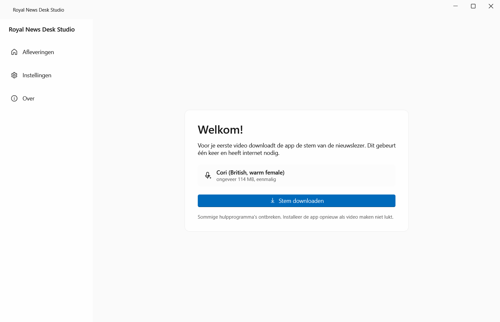

# Handleiding: Royal News Desk Studio

Deze app maakt van jouw geschreven script een complete nieuwsvideo: een stem leest voor, een nieuwslezer beweegt mee, en de app zet er koppen, foto's, een nieuwsticker, ondertitels en een intro en outro bij. Jij schrijft en controleert; de app doet de rest.

## 1. Installeren

1. Ga naar [de downloadpagina](https://github.com/MichaelSchaapDev/royal-news-desk/releases/latest) en klik op **RoyalNewsDesk-win-Setup.exe**.
2. Open het gedownloade bestand.
3. Windows laat mogelijk een blauw scherm zien: "Windows heeft uw pc beschermd". Dat gebeurt bij elke nieuwe app van een kleine maker. Klik op **Meer informatie** en dan op **Toch uitvoeren**.
4. De app installeert zichzelf en start vanzelf. Er komt een snelkoppeling in je startmenu.

## 2. De eerste keer

Bij de eerste start downloadt de app de stem van de nieuwslezer (eenmalig, ongeveer 114 MB). Klik op **Stem downloaden** en wacht tot de balk vol is. Daarna klik je op **Aan de slag**.

## 3. Een aflevering maken

1. Klik op **Nieuwe aflevering**.
2. Geef de aflevering een titel.
3. Plak je volledige Engelse script in het grote vak en klik op **Verdeel in segmenten**. Wil je eerst oefenen? Klik op **Voorbeeldscript laden**.
4. Controleer de segmenten. Elke kop komt straks als balk in beeld.
5. Wil je een foto bij een verhaal? Klik bij dat segment op **Afbeelding kiezen**. De foto verschijnt straks naast de nieuwslezer.

### Zo werkt het script

- Een regel die met `#` begint, wordt een kop en start een nieuw verhaal.
- Een lege regel begint een nieuwe alinea (korte pauze).
- `[PAUSE]` op een eigen regel voegt een extra pauze toe. Langer stil: `[PAUSE: 2]`.
- Een regel die met `//` begint, is een notitie voor jezelf en wordt nooit voorgelezen.
- `TITLE:` op de eerste regel wordt de titel van de aflevering.

## 4. Video maken

Klik rechtsboven op **Video maken**. Je ziet elke stap live voorbijkomen, van het inspreken tot de eindcontrole. Een aflevering van vijf minuten duurt op een gewone computer ongeveer tien tot vijftien minuten. Je kunt altijd op **Stoppen** klikken.

Als alles klaar is, zie je de video meteen in de app. Klik op **Map openen** om het bestand te vinden.

## 5. Waar staat mijn video?

In je map **Video's**, onder **Royal News Desk**, in een map met de naam van je aflevering. Daar staan drie bestanden:

- het videobestand (`.mp4`): dit upload je naar YouTube;
- de ondertitels (`.srt`): deze kun je bij YouTube toevoegen onder Ondertiteling;
- de miniatuur (`thumbnail.png`): deze kun je als thumbnail instellen.

Uploaden gaat via [YouTube Studio](https://studio.youtube.com): sleep het videobestand naar het venster en volg de stappen.

## 6. Instellingen

Onder **Instellingen** kun je aanpassen:

- de taal van de app (Nederlands of Engels);
- licht of donker thema;
- de stem en de voorleessnelheid;
- de naam, slogan en kleuren van je kanaal;
- de map waar video's terechtkomen;
- ondertitels vast in beeld branden (standaard uit; YouTube kan ze los tonen).

## 7. De AI-presentator (optioneel)

Naast de geanimeerde nieuwslezer kan de app een levensechte presentator maken van één foto. Zo werkt het:

1. Ga naar **Instellingen**, kopje **AI-presentator**, en download een van de twee varianten. De snelle variant heeft een NVIDIA-videokaart nodig; de andere werkt op elke pc maar doet er uren over. De download is eenmalig en enkele gigabytes groot.
2. Kies bij **Presentatorfoto** een duidelijke portretfoto. Gebruik alleen een foto waarvan je de rechten hebt, van iemand die ermee instemt in je video's te verschijnen.
3. Kies bij een aflevering onder **Presentator** voor **AI-presentator** en klik op Video maken.

De presentator verschijnt in een kader in de studio, alsof een verslaggever wordt ingebeld. Lukt het maken een keer niet, dan neemt de geanimeerde nieuwslezer het automatisch over en zie je daar een melding van.

## 8. Problemen oplossen

**De download van de stem lukt niet.** Controleer je internetverbinding en klik op Opnieuw proberen.

**De app zegt dat een hulpprogramma wordt tegengehouden.** Je antivirus bekijkt nieuwe programma's soms even. Wacht een minuut en probeer het opnieuw.

**Er is te weinig schijfruimte.** Maak ongeveer 2 GB vrij en klik op Opnieuw proberen.

**Iets anders ging mis.** Start de app opnieuw en probeer het nog een keer. Blijft het misgaan, stuur dan het logbestand naar Michael. Dat vind je zo: druk op de Windows-toets plus R, plak `%LOCALAPPDATA%\RoyalNewsDeskStudio\logs` en druk op Enter. Stuur het nieuwste bestand mee.

## 9. Updates

De app controleert zelf op nieuwe versies. Staat er een update klaar, dan zie je links onderin een knop **Update klaar: herstarten**. Eén klik en je zit op de nieuwste versie.
